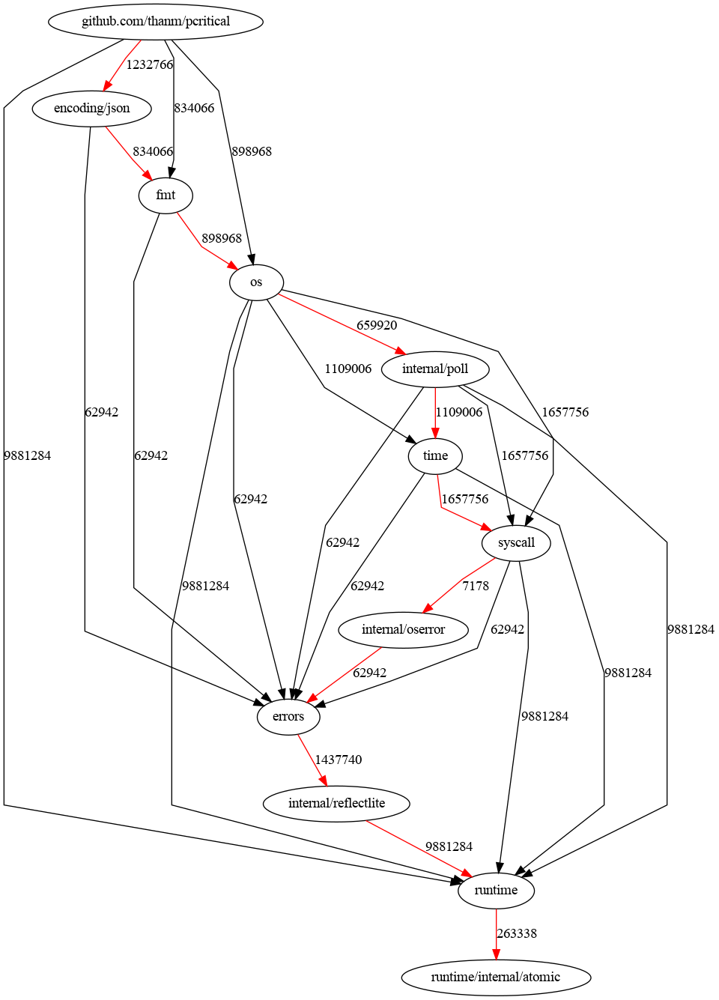

# pcritical

A prototype critical-path finding tool for Go programs.

Given a specific directory in a Go module, this tool enumerates the dependencies of the target and tries to project what will be the critical path for the build. Build time is not measured directly, but rather compiled package size is used a a proxy for build time.

For example, consider the following Go package dependency graph:

```
                 +---+
                 | P |
                 +---+
                 /   \ 
                v     v
              +---+   +---+
              | Q |   | R |
              +---+   +---+
                |   \   |
                v    v  v
              +---+   +---+
              | S |   | T |
              +---+   +---+
```

Suppose that package build sizes/times are: { P=10, Q=11, R=11, T=29, S=3 }. In this case the critical path for building P is { T => R => P }.

On the other hand if instead { S = 99 }, then the critical path for P is { S => Q => P }.

## Running pcritical

To run the tool, supply a target package and the name of a DOT file to generate. Here is an example of running pcritical on itself:

```
./pcritical -dotout me.dot -tgt github.com/thanm/pcritical 
```

which produces this graph:



May take a while to run, since it builds packages to see how large they are.


